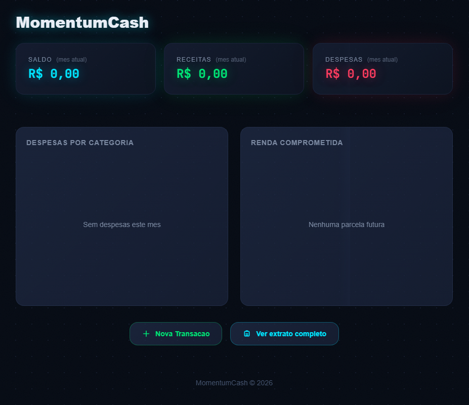

# MomentumCash

Aplicação fullstack para controle financeiro pessoal. Permite registrar receitas e despesas, categorizar transações, acompanhar parcelamentos e visualizar o saldo em tempo real através de um dashboard interativo.



## Features

- **Gerenciamento de Transações**: CRUD completo de receitas e despesas com suporte a descrição, valor, data e categoria.
- **Parcelamento de Transações**: Criação de transações parceladas com controle do número de parcelas e valor de cada parcela.
- **Categorização por Tipo**: Cadastro e filtro de categorias vinculadas a receitas ou despesas.
- **Dashboard Financeiro**: Visualização consolidada do saldo total, receitas, despesas e histórico de transações com gráficos interativos.

## Tech Stack

- **Backend**: C#, .NET 10.0, ASP.NET Core, Entity Framework Core, PostgreSQL
- **Frontend**: Vue 3, Vite, Tailwind CSS, ApexCharts
- **DevOps**: Docker, Docker Compose
- **Arquitetura**: Clean Architecture, Domain-Driven Design (DDD)

## Pré-requisitos

- [.NET 10.0 SDK](https://dotnet.microsoft.com/download/dotnet/10.0)
- [Node.js 20+](https://nodejs.org/)
- [Docker Desktop](https://www.docker.com/products/docker-desktop/) (opcional, para execução via containers)
- PostgreSQL 16 (se não utilizar Docker)

## Como rodar localmente

### Docker Compose

1. Clone o repositório e navegue até a raiz do projeto:

```bash
git clone https://github.com/w-jayson/MomentumCash.git
cd MomentumCash
```

2. Suba todos os serviços (PostgreSQL, API e frontend):

```bash
docker-compose up --build
```

3. Acesse a aplicação:
   - Frontend: [http://localhost:5173](http://localhost:5173)
   - API: [http://localhost:5000](http://localhost:5000)
   - OpenAPI/Swagger: [http://localhost:5000/openapi](http://localhost:5000/openapi)


---

Desenvolvido com C#, .NET 10, Vue 3 e PostgreSQL.
